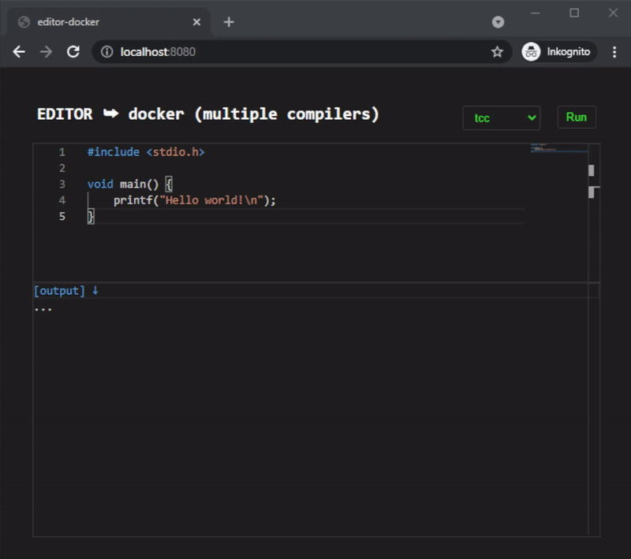

# editor-server-side
  
This is an online **editor** that uses **server-side compilers**.  
  


I am using some well-known frameworks such as *websockets*, [dockerode](https://www.npmjs.com/package/dockerode) or [monaco-editor](https://microsoft.github.io/monaco-editor/) in this project.  
Because of its popularity and prevalence, [Docker](https://www.docker.com/) is suitable for our purposes.  
You can adapt any compiler or programming language as you wish.

## installation

Install [node.js](https://nodejs.org/en/download/), [docker](https://www.docker.com/products/docker-desktop) and all [dependencies](package.json).
  
```
npm install
npm start
```
    
## container configuration

Install [docker](https://docs.docker.com/get-docker) and customize the configuration file `docker/Dockerfile`.

```
FROM <name>
RUN apt update && \
    apt install -y application1 application2 ...
```
  
`docker build -t <name> - < docker/Dockerfile`

Verify the installed applications.

```
docker run <application1> -h
docker run <application2> -h
...
```

Upload your tagged image to registry [docker hub](https://hub.docker.com/).

```
docker login -u <username>

docker tag <name> <username>/<name>
docker push <username>/<name>
```
